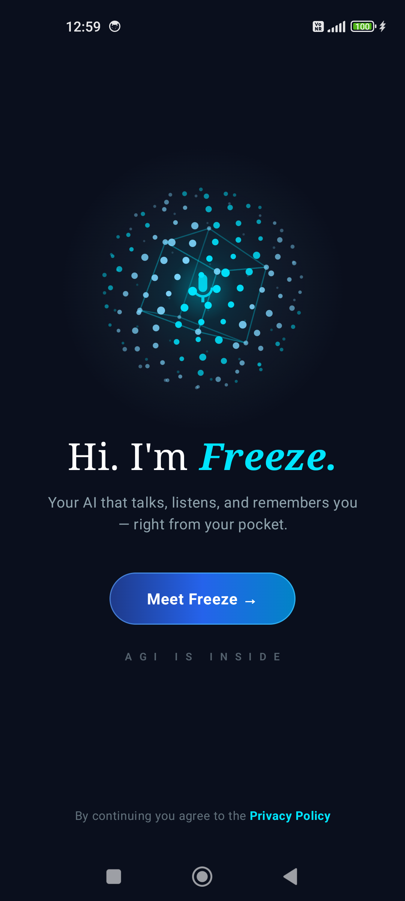
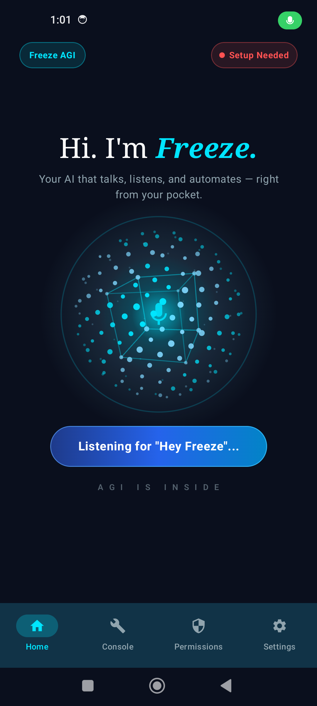
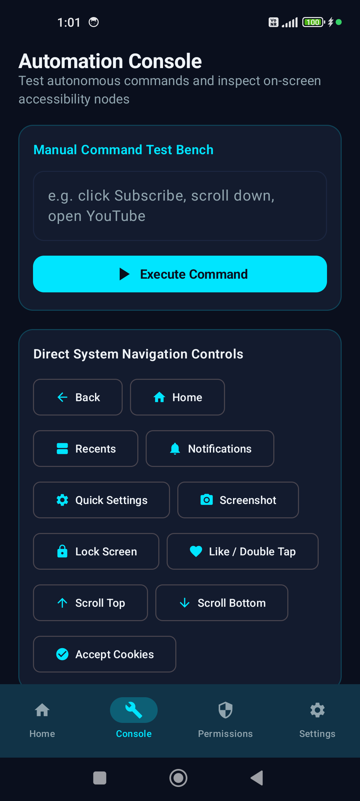
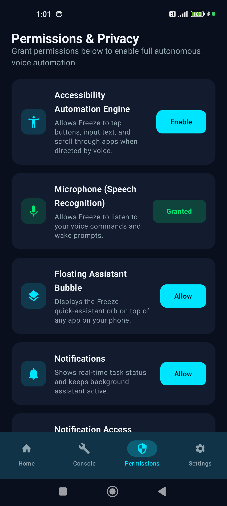
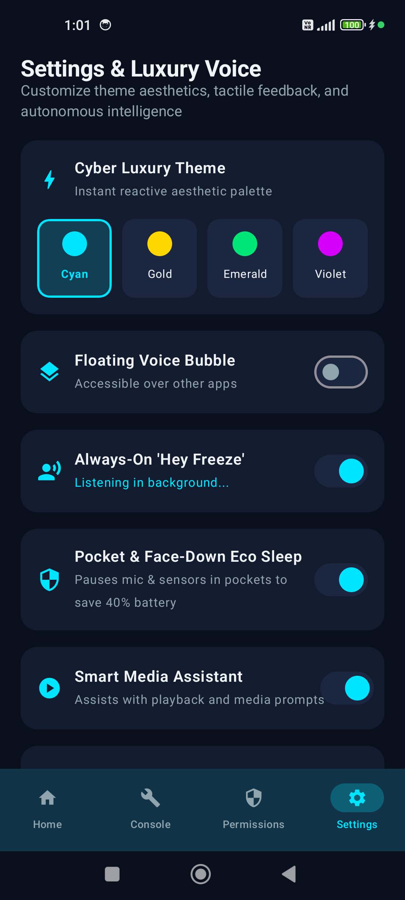

# Freeze AGI ❄️🤖

> **Autonomous On-Device AI Voice Assistant & UI Automation Engine for Android 15+**

  

  
  
  
  

---

## 🌟 Overview

**Freeze AGI** (`com.freeze.assistant`) is a next-generation Android AI assistant engineered for total hands-free autonomous device control, offline wake-word recognition, and intelligent multi-model cloud orchestration.

Powered by a cyber-luxury dark theme with custom glassmorphic cards, luminous status orbs, and instant 1-tap gesture chips, Freeze brings Iron-Man style voice automation directly to your smartphone.

---

## 📸 Screenshots

| 🚀 Onboarding & AI Models | 🎙️ Active Voice Dashboard | ⚡ Automation Console |
| :---: | :---: | :---: |
|  |  |  |

| 🛡️ Prominent Disclosure | 🎨 Cyber-Luxury Settings |
| :---: | :---: |
|  |  |

---

## ✨ Key Features

### 1. 🎙️ Offline Speech & Wake Word Engine
- Built-in **Vosk Kaldi** local speech recognition engine.
- Instant wake word spotting (**"Hey Freeze"**) running 100% on-device with zero internet latency and zero data leakage.

### 2. 🧠 Multi-Model Cloud AI (BYOK)
- Direct TLS 1.3 encrypted communication with leading LLM providers:
  - **Google Gemini 2.5 Flash / Pro**
  - **OpenAI GPT-4o**
  - **xAI Grok**
  - **Local/Offline AI fallback**

### 3. ⚡ 1-Tap Automation Console
- Quick-action gesture chips for automated UI control:
  - ❤️ **Like / Double Tap**: Instant social media double-tap gesture.
  - ⬆️ **Scroll Top**: Rapid smooth scroll to the top of any document or feed.
  - ⬇️ **Scroll Bottom**: Seamless continuous scroll to bottom.
  - 🍪 **Accept Cookies**: Automatically detect and dismiss web consent banners.

### 4. 🔒 Privacy & Google Play Store Compliance
- Full compliance with Google Play Store **Target SDK 35 (Android 15)**.
- Strict **AccessibilityService API Prominent Disclosure** — all gestures require user voice confirmation, zero keystroke/credential logging.
- Includes complete [Privacy Policy](PRIVACY_POLICY.md) ready for Google Play Console submission.

---

## 📦 Downloads & Releases

Production packages are cryptographically signed with a permanent 27-year RSA 2048-bit release keystore:

- 📱 **[Download Production APK (v1.0.0)](../../releases/tag/v1.0.0)** — Ready for direct sideloading and testing on Android 8.0 through Android 15 HyperOS.
- 📦 **[Download Google Play Bundle (.aab)](../../releases/tag/v1.0.0)** — Ready for direct upload to Google Play Console.

---

## 🛠️ Technical Specifications

| Parameter | Specification |
|---|---|
| **Package Name** | `com.freeze.assistant` |
| **Target SDK** | `35` (Android 15 HyperOS) |
| **Minimum SDK** | `26` (Android 8.0 Oreo) |
| **Signature Schemes** | APK Signature Scheme v2 & v3 (SHA-256withRSA) |
| **Zipalign** | 4-byte page aligned |
| **UI Framework** | Jetpack Compose + Material 3 |
| **Speech Engine** | Vosk Kaldi Mobile Offline STT |

---

## 📄 License & Privacy

- **Privacy Policy**: [PRIVACY_POLICY.md](PRIVACY_POLICY.md) | [privacy_policy.html](privacy_policy.html)
- Developed by **[gokularun201-creator](https://github.com/gokularun201-creator)**.
